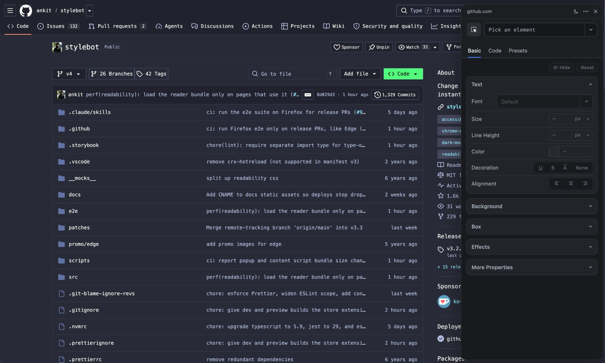

# Stylebot

Stylebot is a browser extension that lets you change the appearance of the web instantly.

Available on [Chrome](https://chrome.google.com/webstore/detail/stylebot/oiaejidbmkiecgbjeifoejpgmdaleoha), [Firefox](https://addons.mozilla.org/firefox/addon/stylebot-web/) and [Edge](https://microsoftedge.microsoft.com/addons/detail/stylebot/mjolbpfednnbebfapicajpifliopnnai).

> [!NOTE]
> Stylebot 4 is under active development on the `v4` branch. The version in the stores is 3.x, released from `main`.

- **Visual editor**: Pick any element and restyle it with UI controls. Empty fields show the page's current values, and other elements a selector matches are highlighted as you edit.
- **Code editor**: Write your own CSS, with autocomplete, color swatches and native CSS nesting.
- **Saved instantly**: Changes apply as you make them. Styles override the site's own by default, and you can turn that off for any style.
- **Dock it or pop it out**: Dock the editor to the left or right of the page, or open it in its own window.
- **Readability mode**: Turn articles into a clean reading view, with a theme and font you choose.
- **Grayscale mode**: Remove color to reduce strain from websites.
- **Google Drive sync**: Back up your styles and keep them in sync across browsers, with conflicts shown for you to resolve.
- **Dark mode support**: The editor, popup and options page follow your system theme, and the editor can also be set to light or dark.

## How to contribute

### Donate

[Buy me a coffee](https://ko-fi.com/stylebot) via Ko-fi

### Translate

Add support for a locale via the following steps

- See [supported locales](https://developer.chrome.com/docs/webstore/i18n#locales)
- If `src/_locales/[locale].config` already exists, please help improve translations
- If not, copy [`src/_locales/en.config`](src/_locales/en.config) to `src/_locales/[locale].config`
- Update strings in `src/_locales/[locale].config` to match the locale

### Add new features or fix bugs

If you'd like to **add a new feature** or **fix a bug**, first **open an issue** on GitHub (if one doesn't already exist), discuss it, and wait for **approval** before sending a pull request.

## Development

Stylebot is built with Vue 2, TypeScript and webpack.

### Setup

- Use the Node version in [`.nvmrc`](.nvmrc) (e.g. `nvm use`)
- Run `yarn install`

### Project layout

- `src/` — extension source (background, content scripts, popup, options page, editor)
- `src/_locales/` — translations
- `e2e/` — Playwright end-to-end tests
- `docs/` — the [stylebot.dev](https://stylebot.dev) site
- `patches/` — patches to dependencies

### Run a development build

Each command builds in watch mode and opens a fresh browser profile with the extension loaded:

- `yarn dev:chrome`
- `yarn dev:edge`
- `yarn dev:firefox`

To load the build into your own Chrome or Edge instead, run `yarn watch`, open `chrome://extensions`, disable the store version of Stylebot, turn on Developer mode, and load `dist/` unpacked. For Firefox, `yarn watch:firefox` builds into `firefox-dist/`.

### Lint and typecheck

- `yarn lint` (or `yarn lint:fix`)
- `yarn typecheck`

### Storybook

Run `yarn storybook` to browse the popup, options page, editor and shared components on port 6006, with a light/dark toggle in the toolbar.

### Tests

- Run `yarn test` for unit tests
- Run `yarn test:storybook` for the Storybook interaction tests (every story rendered headless, play functions asserted); `yarn test:storybook --dev --watch` against a running `yarn storybook` while writing them
- Run `yarn e2e` for the Playwright end-to-end suite (headless Chrome, as in CI); `yarn e2e --firefox --ui` and friends for other browsers and modes — see [`e2e/README.md`](e2e/README.md)

### Google Drive Sync

How sync works, and how to use it from a local build or a fork, is described in [`src/sync/README.md`](src/sync/README.md).

### Release

Releases go through a pull request from a `release/vX.Y.Z` branch — the `release/` prefix is what triggers the Edge e2e suite, which doesn't run on ordinary PRs.

Day-to-day pull requests target `v4`. 3.x releases ship from `main`, and the release workflow only runs on pull requests into it.

- Branch off `main` as `release/vX.Y.Z`
- Add entry to `CHANGELOG`
- Update version in `package.json` and `src/extension/manifest.json`
- Open the PR and wait for `build`, `validation`, `storybook`, `e2e`, `e2e (edge)` and `e2e (firefox)` to pass
- Squash-merge — the GitHub Release and its `vX.Y.Z` tag are then created automatically from the changelog entry
- Chrome and Edge: Run `yarn build` and manually create zip for distribution from `dist/`
- Firefox: Run `yarn build:firefox` and manually create zip for distribution from `firefox-dist/`

### Patches

Patches to dependencies are located under `/patches` and are automatically applied on running `yarn` using [patch-package](https://github.com/ds300/patch-package).

- `vue-draggable-resizable+2.3.0.patch` — removes a `Function("return this")()` call that the extension's Content Security Policy blocks.

## License

Stylebot is MIT licensed.
