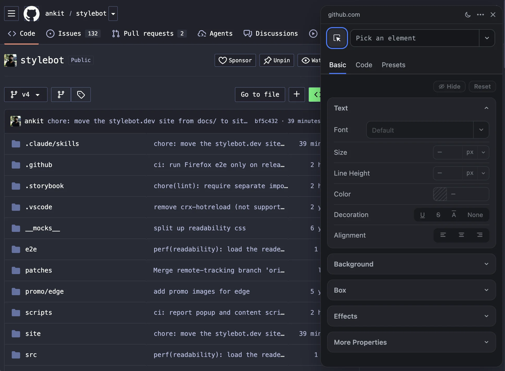

# Stylebot

Stylebot is a browser extension that lets you change the appearance of the web instantly.

Available on [Chrome](https://chrome.google.com/webstore/detail/stylebot/oiaejidbmkiecgbjeifoejpgmdaleoha), [Firefox](https://addons.mozilla.org/firefox/addon/stylebot-web/) and [Edge](https://microsoftedge.microsoft.com/addons/detail/stylebot/mjolbpfednnbebfapicajpifliopnnai).

> [!NOTE]
> Stylebot 4 is under active development on the `v4` branch. The version in the stores is 3.x, released from `main`.

- **Visual editor**: Pick any element and restyle it with UI controls.
- **Code editor**: Write your own CSS, with autocomplete and color swatches.
- **Saved instantly**: Changes apply as you type.
- **Dock or pop out**: Dock the editor left or right, or open it in its own window.
- **Readability mode**: Turn articles into a clean reading view.
- **Grayscale mode**: Remove color to reduce eye strain.
- **Google Drive sync**: Back up and sync your styles across browsers.
- **Dark mode support**: The editor, popup and options page all come in dark.

## How to contribute

### Donate

[Buy me a coffee](https://ko-fi.com/stylebot) via Ko-fi

### Translate

Help translate Stylebot into your language — see [`docs/translation.md`](docs/translation.md).

### Add new features or fix bugs

If you'd like to **add a new feature** or **fix a bug**, first **open an issue** on GitHub (if one doesn't already exist), discuss it, and wait for **approval** before sending a pull request.

## Development

See [`docs/development.md`](docs/development.md) for setup, builds and tests, and [`docs/releases.md`](docs/releases.md) for cutting a release.

## License

Stylebot is MIT licensed.
