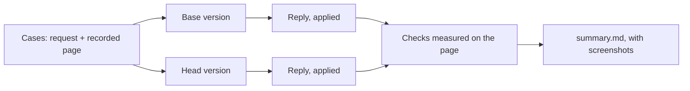
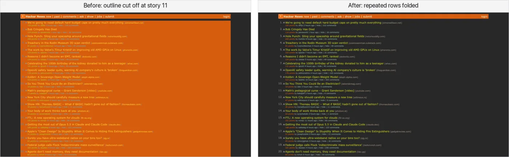
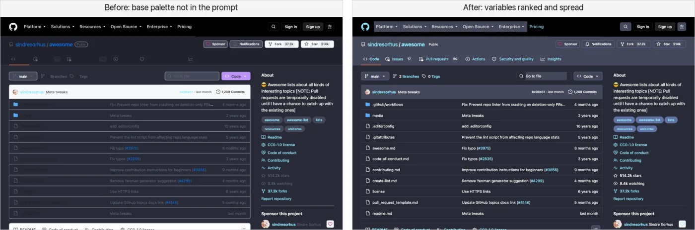
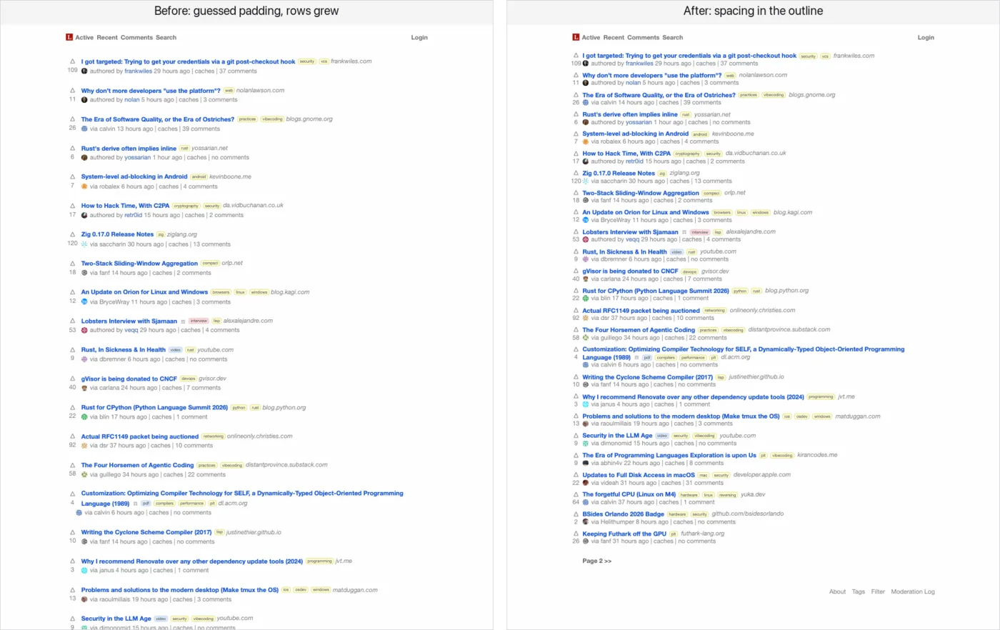

# Chat evals

Unit tests show Chat's plumbing works, not that its replies got better. `yarn eval:chat` measures that: it sends a handful of real styling requests on recorded pages to two versions of Stylebot, applies each reply, and measures on the page whether the request was met.

## Running it

```bash
yarn eval:chat --base HEAD --head .
```

That compares the working tree with the last commit on every case, once each. Open `summary.md` in the results folder it prints. Common variations:

- **Before a PR**, compare against `v4` with `--runs 3`, since replies vary, and put the overall row and any case that got worse in the PR.
- **A subset**: `--cases github-dracula` or `--tags layout`.
- **Another model**: `--head-model claude-haiku-4-5` gives head a different model, effort or thinking, to answer "would Haiku do?" in one run.
- **Only the references**: `--references` checks every case's reference in a few seconds, with no model calls.

A full run makes 12 replies, about 40 cents at list prices, in under a minute.

## How it works



- **Each version is built from its own checkout**, so the comparison is of what each would ship.
- **Pages are recorded once and replayed**, so both versions style the same page.
- **Each version replies with its own Chat's default model** and the options Chat sends with it (Sonnet 5 at low effort today), so the eval tests what users get.
- **Model calls go through headless Claude Code** on the signed-in subscription, not an API key.
- **Results are cached by the code that produced them**, so rerunning against an unchanged base only runs what changed.

## Reading the summary

For each case, the summary has a table with one row per check and a column each for the unstyled page, the case's reference, base and head. A failed check shows the value the page had instead, such as `@contrast 1.22 (was 4.56)`. Below it are screenshots of the original page, the reference and both results.

Above the cases, tables give totals overall, by kind of request and by case:

| Column                                  | What it counts                                                                                         |
| :-------------------------------------- | :----------------------------------------------------------------------------------------------------- |
| **checks**                              | checks passed: whether each request was met, measured on the page                                      |
| zero-match                              | selectors in a reply that matched nothing                                                              |
| asked                                   | cases where a reply made no edits, as when the model asks a question back                              |
| tokens in, tokens out                   | mean per case; thinking counts as output                                                               |
| cost                                    | mean per case, at list prices without caching                                                          |
| seconds                                 | mean per case                                                                                          |
| first edit, last edit                   | when the first call's first and last edits were complete, as Chat applies them while the reply streams |
| reply in                                | when the first call's whole reply was in, as a version applying edits at the end would show them       |
| unreadable, missed surfaces, overridden | from Chat's own check of its edits, for versions that have it; empty until then                        |

No model grades the results. An Opus judge once compared screenshots side by side, but between identical runs it agreed with itself about half the time, and it missed or invented details the checks measure: a font it said had changed, a color it didn't notice. What no check can measure, such as whether a theme looks good, is left to the screenshots.

Replies vary: with identical code on both sides, totals differ by a point or two and a single case by up to three checks. Trust a difference that holds across `--runs 3`.

## Cases

One case for each kind of request people make. Add a case when a kind of request isn't covered.

| Site                      | Request                                                                                                                           | What's checked                                                                         |
| :------------------------ | :-------------------------------------------------------------------------------------------------------------------------------- | :------------------------------------------------------------------------------------- |
| Hacker News               | "Make this page an everforest theme with Fira Code as typography"                                                                 | Everforest colors on the page, top bar and search box; Fira Code titles; readable text |
| GitHub                    | "Give this page a Dracula theme"                                                                                                  | Dracula colors on every surface, from the site header to the readme; readable text     |
| Wikipedia                 | "Make the article read like a book": serif at 19px, 1.6 line height, a centered 680px column, sidebar and Appearance panel hidden | each value; images kept                                                                |
| Lobsters                  | "Make it more compact so more stories fit on screen"                                                                              | rows 20% shorter and the footer on screen, without hiding stories or shrinking titles  |
| React docs                | "Hide the sidebar and let the content use the space"                                                                              | sidebar hidden; content wider and centered                                             |
| A store (Books to Scrape) | 4 columns of cards with 12px corners, a 1px `#e5e7eb` border and soft shadow; bold green prices; full-width pill buttons          | each value; cards that keep their content inside, with nothing overlapping             |

Tags group the cases by kind of request (theme, readability, typography, layout, hide, detailed specs, design systems recolored through CSS variables), and the summary totals each tag separately.

## Checks

A case lists checks for each step of its request, measured on the page after the reply and compared with the unstyled page. Each names elements by selector and expects something of them:

| Expectation                                                     | Example                                                                    |
| :-------------------------------------------------------------- | :------------------------------------------------------------------------- |
| a computed style, exactly or within a tolerance                 | font size 19, line height 30.4±1, border color `#e5e7eb`                   |
| one of several values, or a pattern                             | a Gruvbox background; a serif font family                                  |
| relative to the unstyled page                                   | rows at most 0.8× as tall; links darker; body text the same                |
| a box: width, height, top, distance from center, parent's share | a 680px column within 40px of center; the footer within the first 900px    |
| the background behind the element, and its text's contrast      | a dark background; contrast of at least 4.5                                |
| hidden or still shown; columns in a grid                        | the sidebar hidden; images still shown; every story still shown; 4 columns |
| inside its container, and clear of other elements in it         | prices and buttons inside each card, not covering the cover or title       |

A check looks at the first element that showed before styling, unless it asks for every match or any match.

Some checks guard rather than measure the request: "titles are readable" passes on the unstyled page, and fails only if a reply breaks it.

## References

Each case has a reference: a stylesheet for the result it should get, written the way a reply would write it. It does two jobs:

- **It shows what correct looks like**, as a column in every summary.
- **It tests the checks.** Every check should pass with it, and the checks about the request should fail on the unstyled page. A check that fails with the reference is broken, or the page was recorded again and changed.

Writing a reference is also how to find gaps: if its screenshot looks wrong but every check passes, a check is missing. That's how the checks for overlapping card content were found.

## Adding a case

1. **Check the site loads headless.** Reddit and Stack Overflow block headless browsers, and some news sites cover the page with a consent dialog.
2. **Add the request** to the cases file, with a few checks for what it asks and a guard or two for what it shouldn't break. The page is recorded on the first run, or again with `--record`.
3. **Write its reference** in the references folder, and run `--references --cases <id>` until every check passes with it and the request's checks fail without it.
4. **Look at the reference's screenshot**, and add a check for anything wrong that no check caught.

## What it has caught

**Repeated rows folded**: "apply the same theme to this page" on Hacker News. Before, the outline stopped at story 11, so the story list was left a bright orange slab:



**Variables ranked and spread**: "Give this page a Dracula theme" on GitHub. Before, file names and tabs went dark on dark:



**Spacing in the outline**: "Make it more compact" on Lobsters. Before, guessed padding made the list taller; after, it was about 30% denser:



## Options

| Option                                               | Default                        |                                                                                   |
| :--------------------------------------------------- | :----------------------------- | :-------------------------------------------------------------------------------- |
| `--base` / `--head`                                  | `v4` / `.`                     | the versions to compare; `.` is the working tree                                  |
| `--model` / `--effort` / `--thinking`                | Chat's default and its options | another model, by alias or full ID; its effort; whether it thinks (`on` or `off`) |
| `--head-model` / `--head-effort` / `--head-thinking` | the same as base               | a different setup for head only                                                   |
| `--cases` / `--tags`                                 | all                            | a subset by name, or by tag                                                       |
| `--runs`                                             | 1                              | runs per case                                                                     |
| `--concurrency`                                      | 6                              | cases at once                                                                     |
| `--record`                                           | off                            | record the pages again                                                            |
| `--fresh`                                            | off                            | ignore cached results                                                             |
| `--references`                                       | off                            | only render and score the references                                              |
