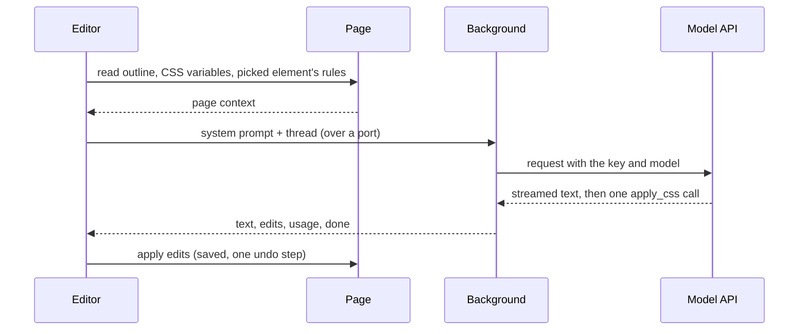
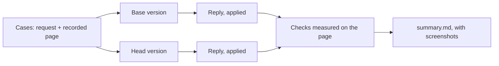

# Chat

The Chat tab turns a request in words ("make this a Gruvbox dark theme") into CSS for the site you're on. You bring your own API key: there's no Stylebot backend and no billing. This page is the map; the code comments carry the detail.

## A reply, end to end



- **The editor builds the prompt**, since it has the page at hand.
- **The background holds the key** and streams the reply. Closing the port (Stop, New chat, closing the editor) aborts it; an open port keeps the service worker alive.
- **The model answers in prose plus one tool call** under a strict schema: selectors, each with property and value pairs. Structured edits, not free CSS, are what make every reply exactly undoable.
- **Edits apply like any other edit**: live, saved, one step on the undo trail. A Google Fonts import is added for any font family the model picks.

## What the model sees

Each reply's system prompt has four parts, rebuilt every turn since the page may have changed:

| Part         | What                                                         | Budget                     |
| :----------- | :----------------------------------------------------------- | :------------------------- |
| Instructions | what Stylebot is, how to answer, how to restyle well         | fixed                      |
| Page outline | the visible elements, compactly                              | 400 lines / 16k characters |
| Page CSS     | the page's CSS variables, and the picked element's own rules | 4k + 8k characters         |
| Stylesheet   | the site's current Stylebot CSS                              | whole                      |

### The outline

An excerpt from Hacker News's front page, as the model reads it. A bare `…` marks lines cut for this page; `… ×N more` is the outline's own folding:

```text
(page) [color #828282, font 13.3px]
center
  table#hnmain[bgcolor="#f6f6ef"] [font 16px]
    tbody
      tr [pad 0, margin 0, h 24px]
        td[bgcolor="#ff6600"] [font 13.3px]
          …
                  span.pagetop "| | | | | |" [color #222222]
                    b.hnname
                      a "Hacker News" [color #000000]
                    a "new" [color #000000]
                    a "past" [color #000000]
                    … ×5 more
      …
              tr#49949235.athing.submission [pad 0, margin 0, h 19px]
                td.title [font 13.3px]
                  span.rank "1."
                …
              tr [pad 0, margin 0, h 11px]
                td [font 13.3px]
                td.subtext [font 9.3px]
                  span.subline "by | |"
                    span#score_49949235.score "242 points"
                    …
              tr.spacer [pad 0, margin 0, h 5px]
              tr#49949438.athing.submission
                …
              … ×84 more
              tr.morespace
      …
          center
            span.yclinks "| | | | | | |" [font 10.7px]
              a "Guidelines" [color #000000]
              a "FAQ" [color #000000]
              … ×6 more
            form "Search:"
              input [bg #ffffff, color #000000]
```

Each choice answers a failure seen in the eval:

- **Visible elements only.** Scripts, styles and the insides of `svg`, `iframe` and `video` are skipped: the model needs the page's structure, not its code.
- **Anonymous wrappers flattened.** A `div` with no id, class or text isn't listed, only its children. It adds depth without information.
- **Enough to write a selector.** Tag, id, up to 4 short classes and 40 characters of the element's own text, as in `span.rank "1."`. Ids and classes are escaped the way selectors need them, so Tailwind's `lg:-mt-16` reads `.lg\:-mt-16`; unescaped, the model copied invalid selectors and react.dev's sidebar never hid.
- **Looks only where they differ from the parent**, as in `td.subtext [font 9.3px]` or the white search `input`. The brackets point at what a request has to change.
- **A `(page)` line on top**: what elements without their own `bg` show.
- **The `bgcolor` attribute.** HN's orange header has no class, so `td[bgcolor="#ff6600"]` is its only selector. It is the element's background, so no `bg` repeats it.
- **Repeats folded, even when they alternate.** Each HN story is three rows (title, subtext, spacer); after two of each, `… ×84 more`. Unfolded, the list ran out of budget at story 11 and the footer never reached the model.
  - A row's kind includes its first children: the subtext row (`td, td.subtext`) folds with its kind, and `tr.morespace` after it doesn't. Plain `tr`s holding different things stay distinct.
  - Named ids never fold; numbered ones do, since they mark list items. `tr#49949235.athing` and `tr#49949438.athing` are one kind.
- **Spacing on the first repeated item**: padding, margin, line-height ratio and height, plus `gap` on containers, as in `[pad 0, margin 0, h 19px]`. Inline runs like the nav links get none. Without it, "make it compact" guessed padding and made rows taller. Zero is spelled out so it doesn't read as unknown.

### The page's CSS variables

Many sites define their palette as variables, and overriding one recolors everything that uses it, states included. The prompt lists the variables set on `html` and `body`, colors first, as rules the model can override.

Design systems define thousands (GitHub's Primer, Discourse), far more than fit. So color variables are ranked:

```text
GitHub, the first four before:              GitHub, the first four now:
--button-danger-shadow-selected: inset …    --fgColor-default: #1f2328
--diffBlob-hunkNum-bgColor-rest: #b6e3ff    --bgColor-default: #fff
--label-brown-fgColor-hover: #64513a        --bgColor-accent-emphasis: #0969da
--display-pink-scale-5: #ce2c85             --fgColor-link: #0969da
```

| Signal                                                                              | Effect                                    |
| :---------------------------------------------------------------------------------- | :---------------------------------------- |
| Its color is one the page shows a lot (sampled backgrounds, text, borders)          | up                                        |
| Short name naming a role: `bg`, `fg`, `text`, `border`, `link`, `accent`, `surface` | up                                        |
| Base words: `default`, `base`, `primary`, `muted`                                   | up                                        |
| Component or scale names (`button`, `badge`, `scale`, digits)                       | down                                      |
| More than 3 names for the same color                                                | the rest wait until every color has had 3 |

The last rule matters on Discourse: ranking alone filled the list with dozens of names for its white, and dropped the precomputed shades its numbers, borders and banner use, so a theme left them light.

### The picked element

With an element picked, the message names its selector, and the page CSS adds the site's own rules for it (up to five matching elements; cross-origin stylesheets are counted, not read). The model can match their specificity and build on their values.

## Undo and Reapply

| Step                 | Recorded                                                                                |
| :------------------- | :-------------------------------------------------------------------------------------- |
| Apply                | for every declaration set, the value it replaced or that there was none                 |
| Undo                 | puts exactly those back, and drops imports of fonts no longer used                      |
| Replaying the thread | each reply's edits as its tool call, with a result saying whether they're still applied |

Only the latest reply can be undone from the chat, since later replies may build on earlier ones. A failed reply keeps your message and offers to send it again with the same picked element and image.

## Context you add

- **A picked element**: the inspector works in Chat; the message is about that element.
- **An image**: paste a screenshot, drop or pick a file. It's scaled to what models read in detail, kept as PNG unless that gets large. No capture permission is needed.

## Providers and keys

Claude, OpenAI and Gemini, each behind one small adapter: check that a key works, stream one reply, and translate between Stylebot's provider-neutral thread and the API's format. Requests go straight from the browser over `fetch` and server-sent events, with no SDKs and no new host permissions. Adding a provider means one adapter and its model list.

| Where | Key                       | What                                         |
| :---- | :------------------------ | :------------------------------------------- |
| local | `chat-provider`           | the provider replies come from               |
| local | `chat-api-key-<provider>` | that provider's key                          |
| local | `chat-model-<provider>`   | the model picked for that provider           |
| local | `chat-thread-<site>`      | the site's conversation, its latest 50 turns |

- One entry per value, so every write is a single set or remove. None of it syncs, and content scripts never receive it.
- **Keys never leave the background.** The editor sees, per provider, whether it's connected, its model and a masked key. A key with another provider's prefix is rejected before any request; others are checked with the provider before they're stored.
- Several providers can be connected. Replies come from the one whose model was picked last; removing its key moves replies to another, and removing the last turns Chat off.
- Providers report tokens, not money, and prices change, so Chat shows no cost; the key screen links to each provider's usage page.

## Evaluating changes

Unit tests show the plumbing works, not that replies got better. `yarn eval:chat` measures that: it sends a handful of real styling requests on recorded pages to two versions of Stylebot, applies each reply, and measures on the page whether the request was met.

### Running it

```bash
yarn eval:chat --base HEAD --head .
```

That compares the working tree with the last commit on every case, once each. Open `summary.md` in the results folder it prints. Common variations:

- **Before a PR**, compare against `v4` with `--runs 3`, since replies vary, and put the overall row and any case that got worse in the PR.
- **A subset**: `--cases github-dracula` or `--tags layout`.
- **Another model**: `--head-model claude-haiku-4-5` gives head a different model, effort or thinking, to answer "would Haiku do?" in one run.
- **Only the references**: `--references` checks every case's reference in a few seconds, with no model calls.

A full run makes 12 replies, about 40 cents at list prices, in under a minute.

### How it works



- **Each version is built from its own checkout**, so the comparison is of what each would ship.
- **Pages are recorded once and replayed**, so both versions style the same page.
- **Each version replies with its own Chat's default model** and the options Chat sends with it (Sonnet 5 at low effort today), so the eval tests what users get.
- **Model calls go through headless Claude Code** on the signed-in subscription, not an API key.
- **Results are cached by the code that produced them**, so rerunning against an unchanged base only runs what changed.

### Reading the summary

For each case, the summary has a table with one row per check and a column each for the unstyled page, the case's reference, base and head. A failed check shows the value the page had instead, such as `@contrast 1.22 (was 4.56)`. Below it are screenshots of the original page, the reference and both results.

Above the cases, tables give totals overall, by kind of request and by case:

| Column                | What it counts                                                                  |
| :-------------------- | :------------------------------------------------------------------------------ |
| **checks**            | checks passed: whether each request was met, measured on the page               |
| zero-match            | selectors in a reply that matched nothing                                       |
| asked                 | cases where a reply made no edits, as when the model asks a question back       |
| tokens in, tokens out | mean per case; thinking counts as output                                        |
| cost                  | mean per case, at list prices without caching                                   |
| seconds               | mean per case                                                                   |
| unreadable, clashing  | from Chat's own check of its edits, for versions that have it; empty until then |

No model grades the results. An Opus judge once compared screenshots side by side, but between identical runs it agreed with itself about half the time, and it missed or invented details the checks measure: a font it said had changed, a color it didn't notice. What no check can measure, such as whether a theme looks good, is left to the screenshots.

Replies vary: with identical code on both sides, totals differ by a point or two and a single case by up to three checks. Trust a difference that holds across `--runs 3`.

### Cases

One case for each kind of request people make. Add a case when a kind of request isn't covered.

| Site                      | Request                                                                                                                           | What's checked                                                                         |
| :------------------------ | :-------------------------------------------------------------------------------------------------------------------------------- | :------------------------------------------------------------------------------------- |
| Hacker News               | "Make this page an everforest theme with Fira Code as typography"                                                                 | Everforest colors on the page, top bar and search box; Fira Code titles; readable text |
| GitHub                    | "Give this page a Dracula theme"                                                                                                  | Dracula colors on every surface, from the site header to the readme; readable text     |
| Wikipedia                 | "Make the article read like a book": serif at 19px, 1.6 line height, a centered 680px column, sidebar and Appearance panel hidden | each value; images kept                                                                |
| Lobsters                  | "Make it more compact so more stories fit on screen"                                                                              | rows 20% shorter and the footer on screen, without hiding stories or shrinking titles  |
| React docs                | "Hide the sidebar and let the content use the space"                                                                              | sidebar hidden; content wider and centered                                             |
| A store (Books to Scrape) | 4 columns of cards with 12px corners, a 1px `#e5e7eb` border and soft shadow; bold green prices; full-width pill buttons          | each value; cards that keep their content inside, with nothing overlapping             |

Tags group the cases by kind of request (theme, readability, typography, layout, hide, detailed specs, design systems recolored through CSS variables), and the summary totals each tag separately.

### Checks

A case lists checks for each step of its request, measured on the page after the reply and compared with the unstyled page. Each names elements by selector and expects something of them:

| Expectation                                                     | Example                                                                    |
| :-------------------------------------------------------------- | :------------------------------------------------------------------------- |
| a computed style, exactly or within a tolerance                 | font size 19, line height 30.4±1, border color `#e5e7eb`                   |
| one of several values, or a pattern                             | a Gruvbox background; a serif font family                                  |
| relative to the unstyled page                                   | rows at most 0.8× as tall; links darker; body text the same                |
| a box: width, height, top, distance from center, parent's share | a 680px column within 40px of center; the footer within the first 900px    |
| the background behind the element, and its text's contrast      | a dark background; contrast of at least 4.5                                |
| hidden or still shown; columns in a grid                        | the sidebar hidden; images still shown; every story still shown; 4 columns |
| inside its container, and clear of other elements in it         | prices and buttons inside each card, not covering the cover or title       |

A check looks at the first element that showed before styling, unless it asks for every match or any match.

Some checks guard rather than measure the request: "titles are readable" passes on the unstyled page, and fails only if a reply breaks it.

### References

Each case has a reference: a stylesheet for the result it should get, written the way a reply would write it. It does two jobs:

- **It shows what correct looks like**, as a column in every summary.
- **It tests the checks.** Every check should pass with it, and the checks about the request should fail on the unstyled page. A check that fails with the reference is broken, or the page was recorded again and changed.

Writing a reference is also how to find gaps: if its screenshot looks wrong but every check passes, a check is missing. That's how the checks for overlapping card content were found.

### Adding a case

1. **Check the site loads headless.** Reddit and Stack Overflow block headless browsers, and some news sites cover the page with a consent dialog.
2. **Add the request** to the cases file, with a few checks for what it asks and a guard or two for what it shouldn't break. The page is recorded on the first run, or again with `--record`.
3. **Write its reference** in the references folder, and run `--references --cases <id>` until every check passes with it and the request's checks fail without it.
4. **Look at the reference's screenshot**, and add a check for anything wrong that no check caught.

### What it has caught

**Repeated rows folded**: "apply the same theme to this page" on Hacker News. Before, the outline stopped at story 11, so the story list was left a bright orange slab:


**Variables ranked and spread**: "Give this page a Dracula theme" on GitHub. Before, file names and tabs went dark on dark:


**Spacing in the outline**: "Make it more compact" on Lobsters. Before, guessed padding made the list taller; after, it was about 30% denser:


### Options

| Option                                               | Default                        |                                                                                   |
| :--------------------------------------------------- | :----------------------------- | :-------------------------------------------------------------------------------- |
| `--base` / `--head`                                  | `v4` / `.`                     | the versions to compare; `.` is the working tree                                  |
| `--model` / `--effort` / `--thinking`                | Chat's default and its options | another model, by alias or full ID; its effort; whether it thinks (`on` or `off`) |
| `--head-model` / `--head-effort` / `--head-thinking` | the same as base               | a different setup for head only                                                   |
| `--cases` / `--tags`                                 | all                            | a subset by name, or by tag                                                       |
| `--runs`                                             | 1                              | runs per case                                                                     |
| `--concurrency`                                      | 6                              | cases at once                                                                     |
| `--record`                                           | off                            | record the pages again                                                            |
| `--fresh`                                            | off                            | ignore cached results                                                             |
| `--references`                                       | off                            | only render and score the references                                              |
