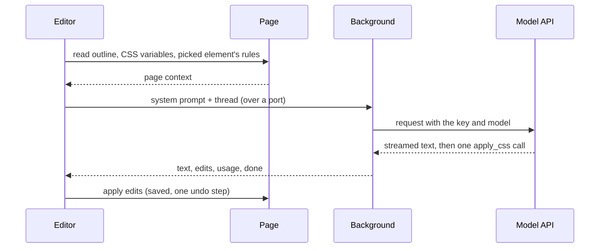
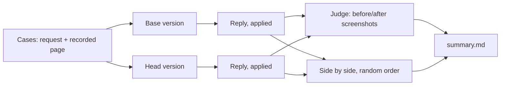

# Chat

The Chat tab turns a request in words ("make this a Gruvbox dark theme") into CSS for the site you're on. You bring your own API key: there's no Stylebot backend and no billing. This page is the map; the code comments carry the detail.

## A reply, end to end



- **The editor builds the prompt**, since it has the page at hand.
- **The background holds the key** and streams the reply. Closing the port (Stop, New chat, closing the editor) aborts it; an open port keeps the service worker alive.
- **The model answers in prose plus one tool call** under a strict schema: selectors, each with property and value pairs. Structured edits, not free CSS, are what make every reply exactly undoable.
- **Edits apply like any other edit**: live, saved, one step on the undo trail. A Google Fonts import is added for any font family the model picks.

## What the model sees

Each reply's system prompt has four parts, rebuilt every turn since the page may have changed:

| Part         | What                                                         | Budget                     |
| :----------- | :----------------------------------------------------------- | :------------------------- |
| Instructions | what Stylebot is, how to answer, how to restyle well         | fixed                      |
| Page outline | the visible elements, compactly                              | 400 lines / 16k characters |
| Page CSS     | the page's CSS variables, and the picked element's own rules | 4k + 8k characters         |
| Stylesheet   | the site's current Stylebot CSS                              | whole                      |

### The outline

An excerpt from Hacker News's front page, as the model reads it. A bare `…` marks lines cut for this page; `… ×N more` is the outline's own folding:

```text
(page) [color #828282, font 13.3px]
center
  table#hnmain[bgcolor="#f6f6ef"] [font 16px]
    tbody
      tr [pad 0, margin 0, h 24px]
        td[bgcolor="#ff6600"] [font 13.3px]
          …
                  span.pagetop "| | | | | |" [color #222222]
                    b.hnname
                      a "Hacker News" [color #000000]
                    a "new" [color #000000]
                    a "past" [color #000000]
                    … ×5 more
      …
              tr#49949235.athing.submission [pad 0, margin 0, h 19px]
                td.title [font 13.3px]
                  span.rank "1."
                …
              tr [pad 0, margin 0, h 11px]
                td [font 13.3px]
                td.subtext [font 9.3px]
                  span.subline "by | |"
                    span#score_49949235.score "242 points"
                    …
              tr.spacer [pad 0, margin 0, h 5px]
              tr#49949438.athing.submission
                …
              … ×84 more
              tr.morespace
      …
          center
            span.yclinks "| | | | | | |" [font 10.7px]
              a "Guidelines" [color #000000]
              a "FAQ" [color #000000]
              … ×6 more
            form "Search:"
              input [bg #ffffff, color #000000]
```

Each choice answers a failure seen in the eval:

| Technique                                                                                                       | Example above                                                                           | Why                                                                                                                   |
| :-------------------------------------------------------------------------------------------------------------- | :-------------------------------------------------------------------------------------- | :-------------------------------------------------------------------------------------------------------------------- |
| Visible elements only; scripts, styles and the insides of `svg`, `iframe`, `video` skipped                      | —                                                                                       | page structure, not page code                                                                                         |
| Anonymous wrappers flattened                                                                                    | a `div` with no id, class or text isn't listed; its children are                        | depth without information                                                                                             |
| Tag, id, up to 4 short classes, 40 characters of own text                                                       | `span.rank "1."`                                                                        | enough to write a selector and recognise the element                                                                  |
| Looks only where they differ from the parent                                                                    | `td.subtext [font 9.3px]`, the white search `input`                                     | the brackets point at what a request must change                                                                      |
| `(page)` base line                                                                                              | first line                                                                              | what elements without their own `bg` show                                                                             |
| `bgcolor` attribute                                                                                             | `td[bgcolor="#ff6600"]`                                                                 | HN's orange header has no class; this is its only selector. It is the element's background, so no `bg` repeats it     |
| **Repeats folded**, even when they alternate                                                                    | stories are three rows (title, subtext, spacer); after two of each, `… ×84 more`        | an unfolded list ran out of budget at story 11, and the footer never reached the model                                |
| Kind of row includes its first children                                                                         | the subtext row (`td, td.subtext`) folds with its kind; `tr.morespace` after it doesn't | plain `tr`s holding different things stay distinct                                                                    |
| Named ids never fold; numbered ones do                                                                          | `tr#49949235.athing` and `tr#49949438.athing` count as one kind                         | numbered ids mark list items                                                                                          |
| **Spacing on the first repeated item**: padding, margin, line-height ratio, height; containers show their `gap` | `[pad 0, margin 0, h 19px]`; inline runs like the nav links get none                    | without it, "make it compact" guessed padding and made rows taller; zero is spelled out so it doesn't read as unknown |

### The page's CSS variables

Many sites define their palette as variables, and overriding one recolors everything that uses it, states included. The prompt lists the variables set on `html` and `body`, colors first, as rules the model can override.

Design systems define thousands (GitHub's Primer, Discourse), far more than fit. So color variables are ranked:

```text
GitHub, the first four before:              GitHub, the first four now:
--button-danger-shadow-selected: inset …    --fgColor-default: #1f2328
--diffBlob-hunkNum-bgColor-rest: #b6e3ff    --bgColor-default: #fff
--label-brown-fgColor-hover: #64513a        --bgColor-accent-emphasis: #0969da
--display-pink-scale-5: #ce2c85             --fgColor-link: #0969da
```

| Signal                                                                              | Effect                                    |
| :---------------------------------------------------------------------------------- | :---------------------------------------- |
| Its color is one the page shows a lot (sampled backgrounds, text, borders)          | up                                        |
| Short name naming a role: `bg`, `fg`, `text`, `border`, `link`, `accent`, `surface` | up                                        |
| Base words: `default`, `base`, `primary`, `muted`                                   | up                                        |
| Component or scale names (`button`, `badge`, `scale`, digits)                       | down                                      |
| More than 3 names for the same color                                                | the rest wait until every color has had 3 |

The last rule matters on Discourse: ranking alone filled the list with dozens of names for its white, and dropped the precomputed shades its numbers, borders and banner use, so a theme left them light.

### The picked element

With an element picked, the message names its selector, and the page CSS adds the site's own rules for it (up to five matching elements; cross-origin stylesheets are counted, not read). The model can match their specificity and build on their values.

## Undo and Reapply

| Step                 | Recorded                                                                                |
| :------------------- | :-------------------------------------------------------------------------------------- |
| Apply                | for every declaration set, the value it replaced or that there was none                 |
| Undo                 | puts exactly those back, and drops imports of fonts no longer used                      |
| Replaying the thread | each reply's edits as its tool call, with a result saying whether they're still applied |

Only the latest reply can be undone from the chat, since later replies may build on earlier ones. A failed reply keeps your message and offers to send it again with the same picked element and image.

## Context you add

- **A picked element**: the inspector works in Chat; the message is about that element.
- **An image**: paste a screenshot, drop or pick a file. It's scaled to what models read in detail, kept as PNG unless that gets large. No capture permission is needed.

## Providers and keys

Claude, OpenAI and Gemini, each behind one small adapter: check that a key works, stream one reply, and translate between Stylebot's provider-neutral thread and the API's format. Requests go straight from the browser over `fetch` and server-sent events, with no SDKs and no new host permissions. Adding a provider means one adapter and its model list.

| Where | Key                       | What                                         |
| :---- | :------------------------ | :------------------------------------------- |
| local | `chat-provider`           | the provider replies come from               |
| local | `chat-api-key-<provider>` | that provider's key                          |
| local | `chat-model-<provider>`   | the model picked for that provider           |
| local | `chat-thread-<site>`      | the site's conversation, its latest 50 turns |

- One entry per value, so every write is a single set or remove. None of it syncs, and content scripts never receive it.
- **Keys never leave the background.** The editor sees, per provider, whether it's connected, its model and a masked key. A key with another provider's prefix is rejected before any request; others are checked with the provider before they're stored.
- Several providers can be connected. Replies come from the one whose model was picked last; removing its key moves replies to another, and removing the last turns Chat off.
- Providers report tokens, not money, and prices change, so Chat shows no cost; the key screen links to each provider's usage page.

## Evaluating changes

Unit tests show the plumbing works, not that replies got better. `yarn eval:chat` measures that.



- **Both versions are built from their own checkout**, so it compares what each would ship. Pages are recorded once and replayed, so both style the same page.
- **Model calls go through headless Claude Code** on the signed-in subscription, not an API key. Haiku runs without extended thinking, as the extension calls it.
- **Results are cached by the code that produced them**: a rerun against an unchanged base only runs what changed. A full cold run takes about six minutes.

### Scores

| Score                | Asks                                                                                                                                                |
| :------------------- | :-------------------------------------------------------------------------------------------------------------------------------------------------- |
| **done** (1–5)       | how fully the result does what was asked; a named theme must use that theme's palette across the whole page                                         |
| **looks** (1–5)      | polish and readability: no unreadable text, no leftover surfaces in the old colors, nothing broken                                                  |
| **aesthetics** (1–5) | pleasing to a careful designer, apart from defects: colors that belong together, clear hierarchy, consistent spacing, restraint                     |
| **preferred**        | which version's result the judge would ship, compared side by side; steadier than the scores, which swing about half a point between identical runs |
| defects              | each visible problem, one line, naming where it is                                                                                                  |

Once Chat checks its own edits, that check also counts what each result left hard to read, the surfaces a theme missed, and declarations the page overrode.

### Cases

Each case tests one thing a real request needs. Tags group them by kind; `core` is a six-case set for a quick check while iterating.

| Tag                     | What it tests                                                                     |
| :---------------------- | :-------------------------------------------------------------------------------- |
| theme                   | a named or described palette applied to every surface, readably                   |
| readability, typography | type size, line length, fonts across the whole page                               |
| layout, hide            | density, hiding parts and letting the rest reflow                                 |
| taste                   | a look ("modern", "newspaper"); `vague` marks the request with no concrete target |
| detailed                | a spec with several explicit values, all of which should land                     |
| precise                 | a small change that should touch nothing else                                     |
| picked                  | a request about the element picked with the inspector                             |
| multi-turn, multi-page  | a follow-up correction; the same theme carried to another page                    |
| variables               | a design system recolored through its CSS variables                               |

| Site                            | Request                                                                                                                           | Tags                              |
| :------------------------------ | :-------------------------------------------------------------------------------------------------------------------------------- | :-------------------------------- |
| Hacker News                     | "Make this page a Gruvbox dark theme"                                                                                             | theme, core                       |
| Hacker News                     | "Make this page a Gruvbox dark theme" → "The footer and the search box still look off, fix them"                                  | theme, multi-turn, core           |
| Hacker News, a story            | "Make these comments easier to read", with a comment picked                                                                       | readability, picked, core         |
| Hacker News                     | "Make it easier to read"                                                                                                          | readability                       |
| Hacker News, story → front page | "Make this page a Gruvbox dark theme" → "apply the same theme to this page"                                                       | theme, multi-page                 |
| Hacker News                     | Gruvbox with an exact color for the page, text, links, visited links, metadata and top bar                                        | theme, detailed                   |
| Wikipedia                       | "Give this page a Nord theme"                                                                                                     | theme                             |
| Wikipedia                       | "Make it easier to read"                                                                                                          | readability, core                 |
| Wikipedia                       | "Make the links a darker blue and underline them"                                                                                 | precise                           |
| Wikipedia                       | "Make the article read like a book": serif at 19px, 1.6 line height, a centered 680px column, sidebar and Appearance panel hidden | readability, typography, detailed |
| GitHub                          | "Give this page a Dracula theme"                                                                                                  | theme, variables, core            |
| GitHub                          | "Restyle this page to use the Nord theme and use monospace typography (Fira Code). Ensure all the elements and colors match up."  | theme, typography, variables      |
| Discourse (Python forum)        | "Use the Catppuccin Mocha theme"                                                                                                  | theme, variables                  |
| Paul Graham's essays            | "Make this essay pleasant to read"                                                                                                | readability, typography           |
| Python docs                     | "Make the code examples stand out and easier to read"                                                                             | readability                       |
| Lobsters                        | "Make it more compact so more stories fit on screen"                                                                              | layout, core                      |
| React docs                      | "Hide the sidebar and let the content use the space"                                                                              | layout, hide                      |
| BBC News                        | "Remove the ads and clutter"                                                                                                      | hide                              |
| arXiv                           | "Make it look modern"                                                                                                             | taste, vague                      |
| A store (Books to Scrape)       | "Make the products look like a modern store: cards with rounded corners and a soft shadow"                                        | taste, layout                     |
| A store (Books to Scrape)       | 4 columns, cards with 12px corners, a 1px border and soft shadow, bold green prices, full-width pill buttons                      | taste, layout, detailed           |
| NPR, text edition               | "Make it look like a printed newspaper"                                                                                           | taste, typography                 |

The summary reads each tag separately, so a vague request's noise doesn't hide a theme's gain. Reddit and Stack Overflow block headless browsers, and some news sites cover the page with a consent dialog, so check a new site loads before adding it.

### What it has caught

**Repeated rows folded** — "apply the same theme to this page" on Hacker News. Before, the outline stopped at story 11, so the story list was left a bright orange slab:


**Variables ranked and spread** — "Give this page a Dracula theme" on GitHub. Before, file names and tabs went dark on dark:


**Spacing in the outline** — "Make it more compact" on Lobsters. Before, guessed padding made the list taller; after, it's about 30% denser with the footer in view:


### Running it

| Flag                  | Default          |                                                  |
| :-------------------- | :--------------- | :----------------------------------------------- |
| `--base` / `--head`   | `v4` / `.`       | the versions to compare; `.` is the working tree |
| `--model` / `--judge` | `haiku` / `opus` | the model replying and the one grading           |
| `--cases` / `--tags`  | all              | a subset by name, or by tag                      |
| `--runs`              | 1                | runs per case, since replies vary                |
| `--concurrency`       | 6                | cases at once                                    |
| `--record`            | off              | record the pages again                           |
| `--fresh`             | off              | ignore cached results                            |

While iterating, run `--tags core` (or the tags a change targets) once with `--judge sonnet` against the previous commit. Before merging a change to the prompt, the outline or the page context, run every case with `--runs 3` against `v4`, and put the overall row and the side-by-side tally in the PR.
