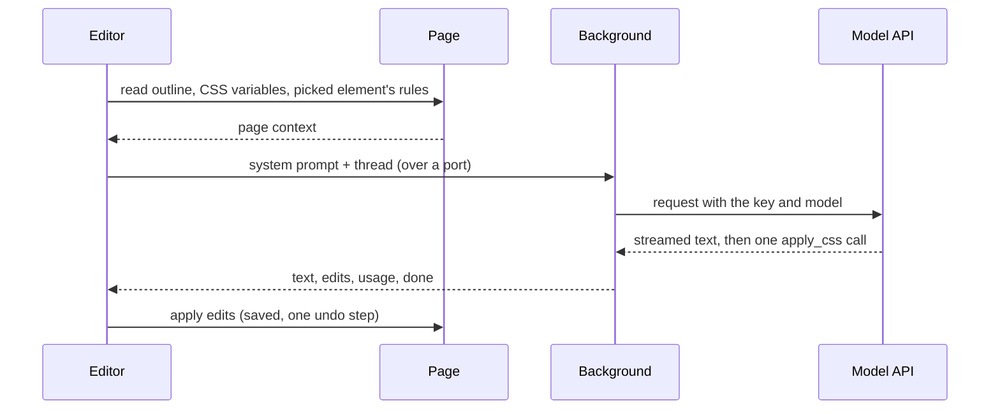

# Chat

The Chat tab turns a request in words ("make this a Gruvbox dark theme") into CSS for the site you're on. You bring your own API key: there's no Stylebot backend and no billing. This page is the map; the code comments carry the detail.

## A reply, end to end



- **The editor builds the prompt**, since it has the page at hand.
- **The background holds the key** and streams the reply. Closing the port (Stop, New chat, closing the editor) aborts it; an open port keeps the service worker alive.
- **The model answers in prose plus one tool call** under a strict schema: selectors, each with property and value pairs. Structured edits, not free CSS, are what make every reply exactly undoable.
- **Edits apply like any other edit**: live, saved, one step on the undo trail. A Google Fonts import is added for any font family the model picks.
- **Hashed classes are saved by their stable part**: a selector naming `.Header_nav__a1B2c` is saved as `[class*="Header_nav__"]`, the same check the picker uses, so the rule outlives the site's next build. The tool result reports the saved selector. Showing that form in the outline instead taught the model to invent loose `[class*=…]` fragments of its own.

## What the model sees

Each reply's system prompt has four parts, rebuilt every turn since the page may have changed:

| Part         | What                                                         | Budget                     |
| :----------- | :----------------------------------------------------------- | :------------------------- |
| Instructions | what Stylebot is, how to answer, how to restyle well         | fixed                      |
| Page outline | the visible elements, compactly                              | 400 lines / 16k characters |
| Page CSS     | the page's CSS variables, and the picked element's own rules | 4k + 8k characters         |
| Stylesheet   | the site's current Stylebot CSS                              | whole                      |

### The outline

An excerpt from Hacker News's front page, as the model reads it. A bare `…` marks lines cut for this page; `… ×N more` is the outline's own folding:

```text
(page) [color #828282, font 13.3px]
center
  table#hnmain[bgcolor="#f6f6ef"] [font 16px]
    tbody
      tr [pad 0, margin 0, h 24px]
        td[bgcolor="#ff6600"] [font 13.3px]
          …
                  span.pagetop "| | | | | |" [color #222222]
                    b.hnname
                      a "Hacker News" [color #000000]
                    a "new" [color #000000]
                    a "past" [color #000000]
                    … ×5 more
      …
              tr#49949235.athing.submission [pad 0, margin 0, h 19px]
                td.title [font 13.3px]
                  span.rank "1."
                …
              tr [pad 0, margin 0, h 11px]
                td [font 13.3px]
                td.subtext [font 9.3px]
                  span.subline "by | |"
                    span#score_49949235.score "242 points"
                    …
              tr.spacer [pad 0, margin 0, h 5px]
              tr#49949438.athing.submission
                …
              … ×84 more
              tr.morespace
      …
          center
            span.yclinks "| | | | | | |" [font 10.7px]
              a "Guidelines" [color #000000]
              a "FAQ" [color #000000]
              … ×6 more
            form "Search:"
              input [bg #ffffff, color #000000]
```

Each choice answers a failure seen in the eval:

- **Visible elements only.** Scripts, styles and the insides of `svg`, `iframe` and `video` are skipped: the model needs the page's structure, not its code.
- **Anonymous wrappers flattened.** A `div` with no id, class or text isn't listed, only its children. It adds depth without information.
- **Enough to write a selector.** Tag, id, up to 4 short classes and 40 characters of the element's own text, as in `span.rank "1."`. Ids and classes are escaped the way selectors need them, so Tailwind's `lg:-mt-16` reads `.lg\:-mt-16`; unescaped, the model copied invalid selectors and react.dev's sidebar never hid.
- **Long classes listed when they have a stable part**, as in BBC's `header.Header-styles__HeaderStyled-sc-36071384-0`. Dropped as too long, they left only random classes like `.lkxsBq`; a reply's selectors are then saved by the stable part (see above).
- **Looks only where they differ from the parent**, as in `td.subtext [font 9.3px]` or the white search `input`. The brackets point at what a request has to change.
- **A `(page)` line on top**: what elements without their own `bg` show.
- **The `bgcolor` attribute.** HN's orange header has no class, so `td[bgcolor="#ff6600"]` is its only selector. It is the element's background, so no `bg` repeats it.
- **Repeats folded, even when they alternate.** Each HN story is three rows (title, subtext, spacer); after two of each, `… ×84 more`. Unfolded, the list ran out of budget at story 11 and the footer never reached the model.
  - A row's kind includes its first children: the subtext row (`td, td.subtext`) folds with its kind, and `tr.morespace` after it doesn't. Plain `tr`s holding different things stay distinct.
  - Named ids never fold; numbered ones do, since they mark list items. `tr#49949235.athing` and `tr#49949438.athing` are one kind.
- **Spacing on the first repeated item**: padding, margin, line-height ratio and height, plus `gap` on containers, as in `[pad 0, margin 0, h 19px]`. Inline runs like the nav links get none. Without it, "make it compact" guessed padding and made rows taller. Zero is spelled out so it doesn't read as unknown.

### The page's CSS variables

Many sites define their palette as variables, and overriding one recolors everything that uses it, states included. The prompt lists the variables set on `html` and `body`, colors first, as rules the model can override.

Design systems define thousands (GitHub's Primer, Discourse), far more than fit. So color variables are ranked:

```text
GitHub, the first four before:              GitHub, the first four now:
--button-danger-shadow-selected: inset …    --fgColor-default: #1f2328
--diffBlob-hunkNum-bgColor-rest: #b6e3ff    --bgColor-default: #fff
--label-brown-fgColor-hover: #64513a        --bgColor-accent-emphasis: #0969da
--display-pink-scale-5: #ce2c85             --fgColor-link: #0969da
```

| Signal                                                                              | Effect                                    |
| :---------------------------------------------------------------------------------- | :---------------------------------------- |
| Its color is one the page shows a lot (sampled backgrounds, text, borders)          | up                                        |
| Short name naming a role: `bg`, `fg`, `text`, `border`, `link`, `accent`, `surface` | up                                        |
| Base words: `default`, `base`, `primary`, `muted`                                   | up                                        |
| Component or scale names (`button`, `badge`, `scale`, digits)                       | down                                      |
| More than 3 names for the same color                                                | the rest wait until every color has had 3 |

The last rule matters on Discourse: ranking alone filled the list with dozens of names for its white, and dropped the precomputed shades its numbers, borders and banner use, so a theme left them light.

### The picked element

With an element picked, the message names its selector, and the page CSS adds the site's own rules for it (up to five matching elements; cross-origin stylesheets are counted, not read). The model can match their specificity and build on their values.

## Undo and Reapply

| Step                 | Recorded                                                                                |
| :------------------- | :-------------------------------------------------------------------------------------- |
| Apply                | for every declaration set, the value it replaced or that there was none                 |
| Undo                 | puts exactly those back, and drops imports of fonts no longer used                      |
| Replaying the thread | each reply's edits as its tool call, with a result saying whether they're still applied |

Only the latest reply can be undone from the chat, since later replies may build on earlier ones. A failed reply keeps your message and offers to send it again with the same picked element and image.

## Context you add

- **A picked element**: the inspector works in Chat; the message is about that element.
- **An image**: paste a screenshot, drop or pick a file. It's scaled to what models read in detail, kept as PNG unless that gets large. No capture permission is needed.

## Providers and keys

Claude, OpenAI and Gemini, each behind one small adapter: check that a key works, stream one reply, and translate between Stylebot's provider-neutral thread and the API's format. Requests go straight from the browser over `fetch` and server-sent events, with no SDKs and no new host permissions. Adding a provider means one adapter and its model list.

| Where | Key                       | What                                         |
| :---- | :------------------------ | :------------------------------------------- |
| local | `chat-provider`           | the provider replies come from               |
| local | `chat-api-key-<provider>` | that provider's key                          |
| local | `chat-model-<provider>`   | the model picked for that provider           |
| local | `chat-thread-<site>`      | the site's conversation, its latest 50 turns |

- One entry per value, so every write is a single set or remove. None of it syncs, and content scripts never receive it.
- **Keys never leave the background.** The editor sees, per provider, whether it's connected, its model and a masked key. A key with another provider's prefix is rejected before any request; others are checked with the provider before they're stored.
- Several providers can be connected. Replies come from the one whose model was picked last; removing its key moves replies to another, and removing the last turns Chat off.
- Providers report tokens, not money, and prices change, so Chat shows no cost; the key screen links to each provider's usage page.

## Evaluating changes

Unit tests show the plumbing works, not that replies got better. [Chat evals](chat-evals.md) covers `yarn eval:chat`, which measures that on recorded pages.
