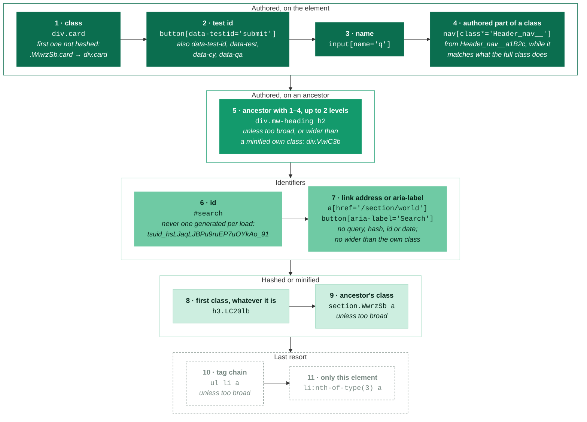

# Selectors

When the user picks an element with the inspector, Stylebot generates a selector for it.
The goal is a selector that is **stable** (survives page rebuilds) and
**meaningful** (reads like something the site author wrote), while still being
specific enough to be useful.

## Priority order

Each strategy is tried in turn, top to bottom, and the first one that gives a
selector wins. The darker a step, the more it trusts that the site wrote the
name on purpose.

Too broad means the selector would sweep the page: a bare `div` or `span`
matching at least 50 elements and over half of that tag on the page, like
`div.app div div`. Other tags never count, since styling every link or
date is a real choice. Sweeping selectors are also left out of the list
below.

Page-wide effects like grayscale keep the selectors body's children got before
any of this (the older hashed-class rules, no partly hashed classes, no
sweeping check), since a saved effect is found again by its exact selector.

## What counts as a "hashed" class

Every class name falls into one of four kinds:

- **Hashed**: a build tool generated it, and it can change on the site's next
  build. Ranked below anything authored, and reported as fragile.
- **Minified**: a compiler shortened it from a map it keeps across releases,
  so it lasts for years. Ranked like a hashed class, except that an element's
  own minified class beats an ancestor scope that matches more, and it isn't
  reported as fragile.
- **Partly hashed**: an authored name with a hash in it. Matched by its
  authored parts with `[class*="…"]`, so it survives the next build.
- **Authored**: anything else. Anything containing `-` or `_` is authored,
  unless a row below says otherwise.

| Source                         | Example                                         | Kind          | Matched as                                  |
| :----------------------------- | :---------------------------------------------- | :------------ | :------------------------------------------ |
| Emotion                        | `css-1q2w3e`                                    | hashed        |                                             |
| Other CSS-in-JS prefixes       | `sc-bdVaJa`, `jsx-123`, `emotion-0`, `chakra-…` | hashed        |                                             |
| React Native Web (X)           | `r-1awozwy`                                     | hashed        |                                             |
| StyleX (Facebook, Instagram)   | `xeuugli`                                       | hashed        | only once the page has 10 such classes      |
| Google bar                     | `gb_Ra`                                         | hashed        |                                             |
| Instagram (legacy)             | `_a6hd`                                         | hashed        |                                             |
| vanilla-extract (The Verge)    | `_7uluu50`                                      | hashed        |                                             |
| Svelte, Astro                  | `svelte-1abc2de`, `astro-J7PV25F6`              | hashed        |                                             |
| next/font                      | `__className_a64ecd`                            | hashed        |                                             |
| JSS, Material UI v4            | `jss123`, `makeStyles-root-12`                  | hashed        |                                             |
| Angular animations             | `ng-tns-c3784233582-0`                          | hashed        |                                             |
| CSS Modules, hex hash          | `_1a2b3c`                                       | hashed        |                                             |
| styled-components style hash   | `kZxyAb`                                        | hashed        | on a page using styled-components           |
| Google (Closure Compiler)      | `LC20lb`, `VwiC3b`, `m5k28`                     | minified      |                                             |
| Other short, case-mixed names  | `MjjYud`, `WwrzSb`                              | minified      |                                             |
| CSS Modules (Next.js, Primer)  | `NavDropdown-module__button__PEHWX`             | partly hashed | `[class*="NavDropdown-module__button__"]`   |
| CSS Modules, dash-separated    | `prc-TopicTag-TopicTag-LS-jX`                   | partly hashed | `[class*="prc-TopicTag-TopicTag-"]`         |
| Turbopack                      | `page-module__E0kJGG__main`                     | partly hashed | `[class*="page-module__"][class*="__main"]` |
| New York Times                 | `ZcdlOG_nav`, `Wr7_RG_mastheadContainer`        | partly hashed | `[class*="_nav"]`                           |
| styled-components display name | `Header-sc-1x2y3z-0`                            | partly hashed | `[class*="Header-sc-"]`                     |
| Vite CSS Modules               | `_card_1wfme_1`                                 | partly hashed | `[class*="_card_"]`                         |
| React id suffix                | `button-label-_R_93ades_`                       | partly hashed | `[class*="button-label-"]`                  |
| Tailwind and other utilities   | `bg-red-500`, `md:flex`, `col-md-12`            | authored      |                                             |
| BEM and other authored names   | `card__title`, `btn--primary`, `isActive`       | authored      |                                             |

How the shapes are told apart:

- **Google's names** have digits among the letters, in 5 lowercase
  characters or mixed case with no capitalised word, so `icon24px` and
  `v2Header` stay authored.
- **Short case-mixed names** are 4–12 characters with an unusually high
  share of case changes, which separates `WwrzSb` from a camelCase word like
  `isActive`. Very short camelCase words can still trip it: `navBar` counts
  as minified.
- **styled-components' style hashes** have the same shape as Google's
  names but change whenever a component's styles do, so on a page with
  styled-components' own style tag or `sc-` classes nothing counts as
  minified.
- **`css-`** needs a digit in its hash, so `css-truncate` stays authored.
- **A partly hashed name's hash** must look like one: letters mixed with
  digits or several capitals (`a1B2c`, but not `item2` or `navBar_item`). A
  dash-separated CSS Modules name also needs a PascalCase component name
  before its 5-character hash, so `col-md-12` stays authored.
- **A partly hashed match is used** only while it matches exactly the
  elements the full class does.

## Other selectors for the element

The selector field also offers the other strategies' selectors for the picked
element, narrowest first, keeping one per set of matched elements, each
with how many elements it matches. The list always starts with:

- **Only this element** — its `#id` when that's unique and not generated,
  otherwise the element and its ancestors, each positioned with
  `:nth-of-type` where a sibling would also match, climbing until only this
  element matches or an ancestor has a unique `#id`. Positions shift when a list reorders, so this
  is the least stable choice.
- **This item** — elements like it inside the nearest repeated ancestor (a
  row, list item or card), e.g. `tr.athing:nth-of-type(3) a` for every link
  in one row.

## Reusing existing rules

Before generating a fresh selector, the inspector checks whether the user's
CSS already has a selector that matches this element — via the browser's own `el.matches()`, not string
comparison. That way picking an element already targeted by a hand-written
selector (a descendant combinator, `:nth-child`, one member of a grouped
selector, …) continues editing that rule instead of starting a second,
disconnected one. Interaction pseudo-classes like `:hover` and `:focus` are
excluded, since matching one of those only means the cursor happens to be on
the element right now.

Only selectors that target the element itself are reused: the subject (the
rightmost compound) must carry a class, id, attribute or structural
pseudo-class (`:nth-child`, `:first-of-type`, …). A broad selector like `*`,
`a` or `.card p` would otherwise capture every element it matches and keep the
user from styling the one they picked. A tag-only selector is still reused when
it's exactly what would be generated for the element anyway (e.g.
`div.mw-heading h2`).
